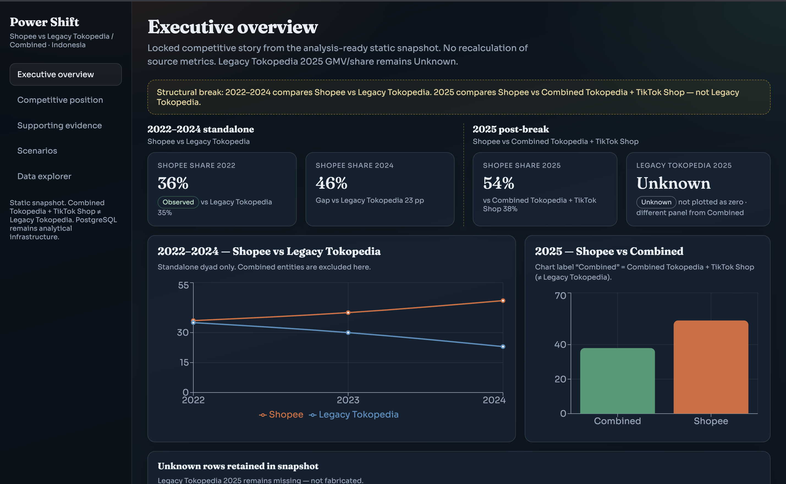
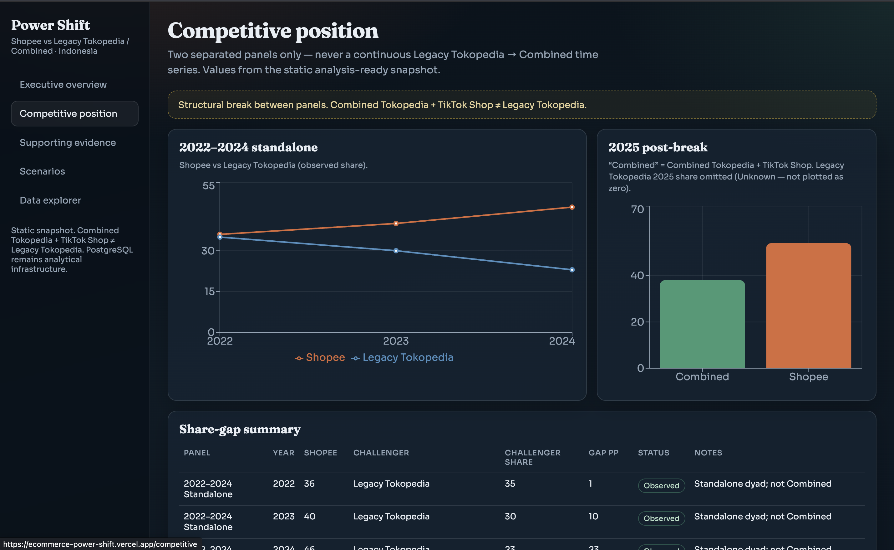
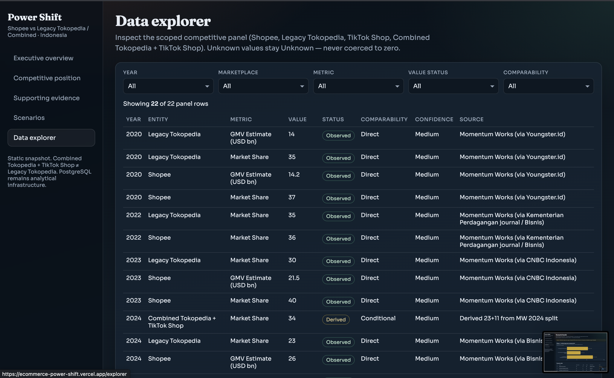
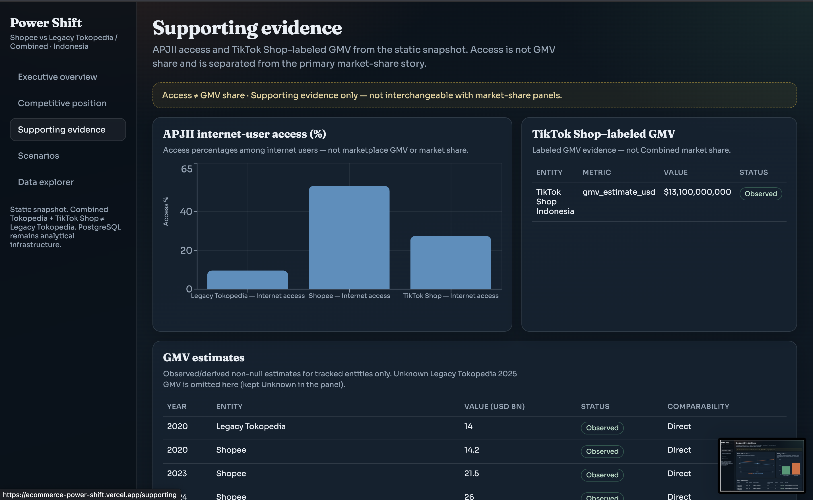

# E-Commerce Power Shift: Shopee vs Tokopedia in Indonesia

Portfolio data analytics project investigating competitive market-position changes in Indonesia's e-commerce landscape through a reproducible research pipeline and static executive dashboard.

🔗 **[View Live Dashboard](https://ecommerce-power-shift.vercel.app/)**

---

## Dashboard Preview









---

## Portfolio Overview

This project examines how Shopee's competitive position changed relative to Tokopedia-related entities in Indonesia, with particular attention to the structural break surrounding the Tokopedia–TikTok Shop combination.

The dashboard presents evidence-labeled market-share and supporting metrics while explicitly separating observed values from derived, unknown, and illustrative scenario values.

The project demonstrates:

- **2022–2024 standalone comparison:** Shopee vs Legacy Tokopedia
- **2025 post-break comparison:** Shopee vs Combined Tokopedia + TikTok Shop
- Explicit **UNKNOWN** handling where Legacy Tokopedia 2025 standalone share is not supported
- Supporting internet-access evidence from APJII
- TTS-labeled GMV supporting evidence
- Scenario gap bands clearly labeled as **SCENARIO**, not forecasts-as-fact
- A filterable analysis-ready panel covering year, marketplace, metric, value status, and comparability
- PostgreSQL and SQL analytical infrastructure behind the dashboard
- Validation gates designed to prevent unsupported values from entering the public dashboard

The project deliberately avoids:

- Fabricating proprietary platform data
- Treating Combined Tokopedia + TikTok Shop as Legacy Tokopedia
- Plotting UNKNOWN values as zero
- Treating internet access as equivalent to GMV or market share
- Presenting illustrative scenarios as observed outcomes
- Making unsupported causal claims about why a platform gained or lost share

---

## Business Problem

Strategy and commercial teams need a transparent view of how competitive position changed over time, what evidence supports those changes, and where uncertainty remains.

The central challenge is that Indonesia's e-commerce landscape changed materially around 2024–2025. A simple time-series comparison can therefore become misleading if post-break entities are treated as directly comparable to their pre-break counterparts.

This project was designed to answer:

> **How did Shopee's competitive position in Indonesia change relative to Tokopedia, and what observable market factors help explain that shift?**

The analysis therefore focuses not only on the numbers themselves, but also on whether those numbers are actually comparable.

---

## Key Analytical Finding

The locked reference shares used throughout the dashboard are:

| Period | Shopee | Tokopedia-related entity | Interpretation |
|---|---:|---:|---|
| 2022 | 36% | 35% Legacy Tokopedia | Standalone comparison |
| 2024 | 46% | 23% Legacy Tokopedia | Standalone comparison |
| 2025 | 54% | 38% Combined | Post-break comparison |

**Important:** the 2025 **38% Combined** value is not treated as a 2025 Legacy Tokopedia value.

Legacy Tokopedia's 2025 standalone GMV/share is therefore explicitly represented as:

> **UNKNOWN**

rather than being inferred, estimated, or plotted as zero.

---

## Structural Break

A major analytical requirement of this project is correctly handling the 2024 → 2025 structural break.

Before the break:

```text
Shopee
    vs
Legacy Tokopedia
```

After the break:

```text
Shopee
    vs
Combined Tokopedia + TikTok Shop
```

These are not equivalent entities.

Therefore:

- 2022–2024 comparisons use the standalone Shopee vs Legacy Tokopedia dyad.
- 2025 uses Shopee vs Combined.
- Legacy Tokopedia 2025 remains UNKNOWN.
- The dashboard does not create a false continuous Legacy Tokopedia series.

This distinction is central to the project's analytical integrity.

---

## Evidence Classification

All important analytical values are classified using explicit evidence statuses:

| Status | Meaning |
|---|---|
| `OBSERVED` | Directly supported by the underlying source |
| `DERIVED` | Calculated from supported source values |
| `UNKNOWN` | Required value is not sufficiently supported |
| `SCENARIO` | Illustrative analytical scenario, not an observed result |

This classification is carried through the analysis-ready panel and dashboard layer.

---

## Analytical Architecture

The project separates analytical work from public dashboard presentation.

```text
Raw Sources
    ↓
Python ETL / Cleaning / Validation
    ↓
Canonical / Analysis-Ready Data
    ↓
PostgreSQL + SQL Analytical Layer
    ↓
Validation
    ↓
Dashboard Export
    ↓
Static JSON Snapshot
    ↓
React / Vite Dashboard
    ↓
Vercel
```

The analysis-ready panel acts as the primary analytical checkpoint before dashboard consumption.

This prevents the frontend from independently reconstructing business logic or recalculating locked analytical outputs.

---

## Data & Research Workflow

### 1. Source Acquisition

Traceable public sources are preserved with provenance information.

### 2. Data Preparation

Source data is cleaned and transformed into canonical datasets while preserving source lineage.

### 3. Structural-Break Investigation

The 2024 → 2025 entity change is explicitly investigated before market-share comparisons are made.

### 4. Evidence Classification

Values are labeled as:

```text
OBSERVED
DERIVED
UNKNOWN
SCENARIO
```

### 5. Analysis-Ready Panel

The validated panel becomes the controlled analytical input for downstream dashboard outputs.

### 6. PostgreSQL Analytical Layer

The project includes a PostgreSQL schema and SQL views representing the analytical layer.

### 7. Validation

Locked values and structural rules are validated before dashboard export.

### 8. Static Dashboard Export

Validated analytical outputs are exported into:

```text
frontend/public/data/dashboard_data.json
```

The public dashboard then consumes that snapshot rather than connecting directly to the analytical database.

---

## Dashboard

The public dashboard contains several analytical views.

### Overview

Provides the executive-level comparison and separates:

- **2022–2024 standalone comparison**
- **2025 post-break comparison**

The 2025 panel explicitly preserves UNKNOWN handling for Legacy Tokopedia.

### Competitive

Presents the main market-position comparison across the supported periods.

### Scenarios

Presents illustrative gap-band scenarios derived from the validated snapshot and scenario inputs.

Scenario values are explicitly labeled as:

> `SCENARIO`

They are not presented as forecasts or observed market outcomes.

### Supporting

Provides supporting evidence such as internet-access metrics and TTS-labeled GMV.

Access metrics are explicitly labeled as access rather than GMV.

---

## Supporting Internet Access Evidence

Internet-access metrics are treated as supporting evidence only.

The dashboard therefore uses labels such as:

```text
Shopee — Internet access
TikTok Shop — Internet access
Legacy Tokopedia — Internet access
```

rather than presenting access as market share or GMV.

Locked supporting access values include:

```text
9.57
53.22
27.37
```

These values are unchanged by the presentation layer.

---

## Scenario Analysis

Scenario analysis is used to explore illustrative competitive gaps without overstating certainty.

The scenario layer is intentionally separated from observed market-share results.

The dashboard derives scenario copy from the validated snapshot and scenario `base_2025_value` rather than hard-coding analytical values into the frontend.

This keeps the presentation layer synchronized with the underlying analytical outputs.

---

## Technology Stack

### Data & Analysis

- Python
- pandas
- NumPy
- scikit-learn
- Matplotlib
- Statistical / analytical validation

### Database

- PostgreSQL
- SQL
- Analytical schema
- SQL views
- Dashboard export queries

### Frontend

- React
- TypeScript
- Vite
- CSS

### Deployment

- GitHub
- Vercel

---

## Repository Structure

```text
ecommerce-power-shift/
│
├── analysis/
│   ├── charts.py
│   ├── load.py
│   ├── run_analysis.py
│   └── outputs/
│       ├── figures/
│       └── tables/
│
├── data/
│   ├── raw/
│   ├── processed/
│   ├── dashboard/
│   └── metadata/
│
├── docs/
│   ├── ARCHITECTURE.md
│   ├── DATA_AVAILABILITY.md
│   ├── DATA_DICTIONARY.md
│   ├── DATA_SOURCES.md
│   ├── PRD.md
│   ├── RESEARCH_METHOD.md
│   ├── TODO.md
│   ├── WORKFLOW.md
│   └── screenshots/
│
├── forecasting/
│
├── frontend/
│   ├── public/
│   │   └── data/
│   │       └── dashboard_data.json
│   └── src/
│       ├── pages/
│       └── ...
│
├── python/
│
├── research/
│
├── scripts/
│
├── sql/
│
├── tests/
│
├── .env.example
├── .gitignore
├── AGENTS.md
├── README.md
└── requirements.txt
```

---

## Environment Variables

The public dashboard does not require database credentials or an API connection.

| Variable | Public UI | Purpose |
|---|---|---|
| `DATABASE_URL` | No | Local PostgreSQL analytical layer |
| API URL | No | No public API required |

The environment template is provided in:

```text
.env.example
```

No production database credentials are required by the public Vercel deployment.

---

## Local Setup

### Python Environment

```bash
python3 -m pip install -r requirements.txt
```

### PostgreSQL Analytical Layer

Configure a local PostgreSQL database:

```bash
export DATABASE_URL=postgresql://localhost:5432/ecommerce_power_shift
createdb ecommerce_power_shift
```

Build the SQL analytical layer:

```bash
python3 scripts/build_dashboard_sql.py
```

### Generate Dashboard Snapshot

```bash
python3 scripts/export_dashboard_data.py
```

This generates:

```text
frontend/public/data/dashboard_data.json
```

### Frontend

```bash
cd frontend
npm install
npm run dev
```

The dashboard can then be opened locally through the Vite development server.

---

## Validation

The project includes automated validation across the analytical and frontend layers.

### Python / Gate Validation

```bash
python3 -m pytest tests/ -q
```

### Frontend

```bash
cd frontend
npm test
npm run build
```

The final validation included:

- Vitest: **9 passed**
- Gate 10 pytest: **4 passed**
- Panel: **22 rows**
- Allowlist intact
- Peer entities absent
- Gap bands: **1 / 23 / 16**
- Shopee 2025: **54**
- Combined 2025: **38**
- Legacy Tokopedia 2025: **UNKNOWN**
- Access values: **9.57 / 53.22 / 27.37**
- Scenario SHA: `918635ad9898455d`

Analytical outputs were unchanged by the final presentation-honesty fixes.

---

## Dashboard Data Contract

The public frontend consumes the validated static snapshot:

```text
frontend/public/data/dashboard_data.json
```

The dashboard data contract is documented in:

```text
research/dashboard_data_contract.md
```

The static snapshot approach was selected because this project presents historical analytical results rather than live transactional data.

---

## Production Deployment

The public dashboard is deployed as a static React application.

### Vercel Configuration

```text
Root Directory:
frontend

Build Command:
npm run build

Output Directory:
dist
```

The deployment does not require:

- Public PostgreSQL
- `DATABASE_URL`
- FastAPI
- Express
- Public database credentials
- CORS configuration

The public deployment flow is:

```text
GitHub
   ↓
Vercel
   ↓
frontend/
   ↓
Vite build
   ↓
Static dashboard
```

---

## Known Limitations

This project intentionally has several limitations.

### Historical Snapshot

The public dashboard is read-only and based on a validated historical snapshot.

It is not a live market-monitoring system.

### Legacy Tokopedia 2025

Legacy Tokopedia's 2025 standalone GMV/share is:

```text
UNKNOWN
```

No unsupported value is substituted.

### Combined ≠ Legacy Tokopedia

The 2025 Combined value represents the post-break entity and should not be interpreted as Legacy Tokopedia's standalone performance.

### Access ≠ GMV

Internet-access metrics are supporting evidence and are not treated as marketplace GMV or market share.

### Scenario ≠ Forecast

Scenario bands are illustrative analytical ranges and are not presented as factual forecasts.

### No Fabricated Causal Narrative

The project does not claim that any single factor definitively explains Shopee's competitive position without sufficient evidence.

### Manual Screenshots

Dashboard screenshots are captured manually from the deployed application and stored under:

```text
docs/screenshots/
```

---

## Key Documentation

| Document | Purpose |
|---|---|
| `docs/PRD.md` | Product requirements |
| `docs/ARCHITECTURE.md` | System and analytical architecture |
| `docs/DATA_AVAILABILITY.md` | Data availability and constraints |
| `docs/DATA_DICTIONARY.md` | Data definitions |
| `docs/DATA_SOURCES.md` | Source provenance |
| `docs/RESEARCH_METHOD.md` | Research methodology |
| `docs/WORKFLOW.md` | End-to-end workflow |
| `docs/TODO.md` | Remaining optional/manual work |
| `research/gate7b_dashboard_sql_schema.md` | PostgreSQL analytical layer |
| `research/dashboard_data_contract.md` | Dashboard data contract |
| `research/gate9_validation_report.md` | Analytical validation |
| `research/gate10_deployment.md` | Deployment validation |
| `AGENTS.md` | Repository operating instructions |

---

## Status

### Portfolio Ready

The scoped analytical deliverable is complete.

The completed scope includes:

- Evidence-labeled analytical outputs
- Structural-break handling
- Analysis-ready panel
- Scenario analysis
- PostgreSQL analytical layer
- Dashboard export
- Static React dashboard
- Frontend validation
- Production build validation
- Static Vercel deployment
- Dashboard preview screenshots
- Repository documentation

Optional backlog items and manual maintenance tasks remain non-blocking.

---

## Author

**Lexter Morgan**

Data Analytics · Business Intelligence · Python · SQL · PostgreSQL · React

🔗 **[GitHub](https://github.com/LexterMorgan)**

🔗 **[Live Dashboard](https://ecommerce-power-shift.vercel.app/)**
